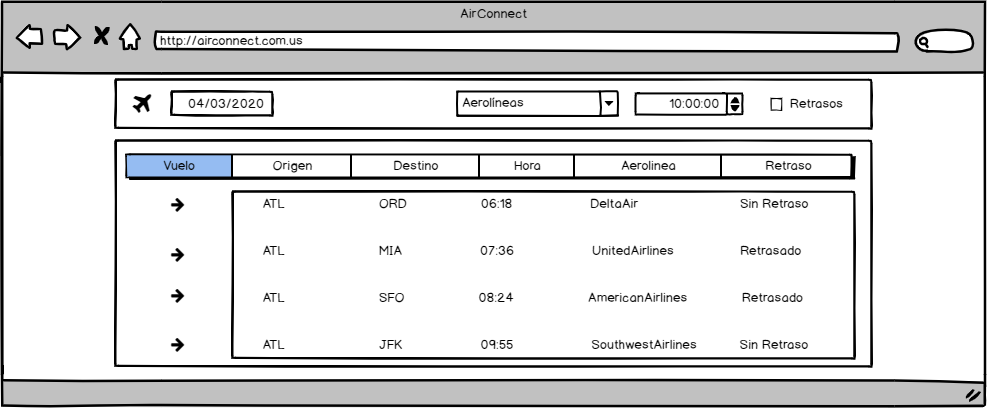
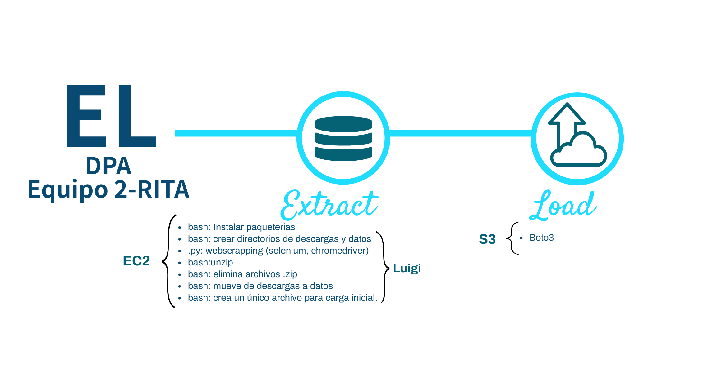

# Proyecto Arquitectura de Producto de Datos
Repositorio del equipo 2 del proyecto de la materia Data Product Architecture.

+ Laura Gómez Bustamante 191294 
+ Miguel Ángel Millán Dorado 191401 
+ Elizabeth Rodríguez Sánchez 191430 
+ Marco Julio Monroy Ayala 187825 
+ Rodrigo Suárez Segovia 191351

## Objetivo del proyecto:

Garantizar la eficiencia de las operaciones aeroportuarias mediante un producto de datos basado en información relacionada con el vuelo (fecha, origen, destino, etc), capaz de predecir si habrá un retraso crítico (mayor a 20 minutos) para el despegue, disminuyendo los costos operativos relacionados al efecto dominó de los retrasos en las salidas de vuelos.

## Problemática a resolver:

El negocio de los aeropuertos incluye muchos procesos, regulaciones y partes interesadas definidas. Que un vuelo despegue a tiempo depende de múltiples factores: como la distancia al suelo, la autorización del control de tráfico aéreo, la reposición de alimentos, el reabastecimiento de combustible así como retrasos de vuelos procedentes de otros lugares. Una demora en cualquiera de estos factores puede llevar a un efecto dominó en las operaciones del aeropuerto. 

Imaginemos cuál sería el impacto en un aeropuerto con alto tráfico como los de Atlanta, Chicago o Beijing. Las cosas se vuelven aún más difíciles en el caso de condiciones climáticas extremas o eventos perturbadores. Con un número cada vez mayor de pasajeros y vuelos, la eficiencia operativa se ha convertido en un gran desafío para los aeropuertos.

Mejorar la eficiencia y el rendimiento general de un aeropuerto se pueden lograr mediante el intercambio de información en tiempo real con todas las partes interesadas. Por tanto, este producto de datos representa un diferenciador importante que empodera y da libertad a operadores de servicios aeroportuarios, brindándoles información importante de posibles retrasos; permitiendo tomar decisiones a las partes interesadas del aeropuerto (operadores de aeropuertos, líneas aéreas, operadores de tierra y controladores de tráfico aéreo, etc.) intercambiando información de retrasos, y alentando a la colaboración para una gestión eficiente de las operaciones, buscando disminuir los costos involucrados en dichos retrasos.

## Recursos

+ Información del Departamento de Transporte de los EUA (https://www.transtats.bts.gov/DL_SelectFields.asp?Table_ID=236)
+ Servicios de AWS para almacenamiento y procesamiento

## Pipeline

## Descripción de las variables
La información que será utilizada para el desarrollo de este proyecto contiene detalles sobre el despegue y arribo de los vuelos comerciales dentro de Estados Unidos, de octubre de 1987 a diciembre de 2019. El dataset contiene alrededor de 100 variables ubicado en la siguiente ruta: https://www.transtats.bts.gov/DL_SelectFields.asp?Table_ID=236. La información está disponible en archivos con formato .csv.
En principio la información es actualizada de forma mensual; sin embargo se desconoce la fecha exacta de actualización. 

Debido a la cantidad de variables con que se cuenta, y tomando como base la información utilizada en **data expo Airline on-time performance**  (http://stat-computing.org/dataexpo/2009/the-data.html), nos limitaremos a trabajar únicamente con las siguientes 29 variables:

||Nombre variable	|Descripción|
|---|---|---|
|1	|report	|Year (from 1987 to the present)|
|2	|MONTH	|1-12|
|3	|DAY\_OF\_MONTH	|1-31|
|4	|DAY\_OF_WEEK	|1 (Monday) - 7 (Sunday)|
|5	|DEP_TIME	|Actual departure time (local, hhmm)|
|6	|CRS\_DEP_TIME	|Scheduled departure time (local, hhmm)|
|7	|ARR_TIME	|Actual arrival time (local, hhmm)|
|8	|CRS\_ARR_TIME	|Scheduled arrival time (local, hhmm)|
|9	|OP\_UNIQUE_CARRIER|Unique carrier code|
|10	|OP\_CARRIER\_FL\_NUM	|Flight number|
|11	|TAIL_NUM	|Plane tail number|
|12	|ACTUAL\_ELAPSED_TIME	|Elapsed Time of Flight, in minutes|
|13	|CRS\_ELAPSED_TIME	|CRS Elapsed Time of Flight, in minutes|
|14	|AIR_TIME	|Flight Time, in minutes|
|15	|ARR_DELAY	|Difference in minutes between scheduled and actual arrival time. Early arrivals show negative numbers.|
|16	|DEP_DELAY	|Difference in minutes between scheduled and actual departure time. Early departures set to 0.|
|17	|ORIGIN	|Origin IATA airport code|
|18	|DEST	|Destination IATA airport code|
|19	|DISTANCE	|Distance between airports, in miles|
|20	|TAXI_IN	|Taxi in time, in minutes|
|21	|TAXI_OUT	|Taxi out time in minutes|
|22	|CANCELLED	|Cancelled Flight Indicator (1=Yes)|
|23	|CANCELLATION_CODE	|Reason for cancellation (A = carrier, B = weather, C = NAS, D = security)|
|24	|DIVERTED	|Diverted Flight Indicator, 1 = yes, 0 = no|
|25	|CARRIER_DELAY	|Carrier Delay, in minutes|
|26	|WEATHER_DELAY	|Weather Delay, in minutes|
|27	|NAS_DELAY	|National Air System Delay, in minutes|
|28	|SECURITY_DELAY	|Security Delay, in minutes|
|29	|LATE\_AIRCRAFT_DELAY	|Late Aircraft Delay, in minutes|

## Proceso ELT

El proyecto requerirá la aplicación de un proceso ELT, el cual se efecturará conforme a lo siguiente:

+ EXTRACT

Este parte del proceso requerirá de una carga inicial que permita obtener los datos históricos con los que se desarrollará el producto de datos. Adicionalmente será necesario realizar una carga periódica (mensual) con los datos sobre los que se realizarán las predicciones. 
Con relación a la carga inicial, a partir de una instancia EC2 se ejecutará lo siguiente:

+ Script de bash que permita instalar las paqueterías y programas necesarios: Chrome-Driver, Google Chrome, Luigi, Python 3.6 y Selenium.
+ Script de bash que permita crear los directorios *Descargas* y *Datos*.
+ Archivo .py para realizar web-scrapping utilizando Selenium y Chrome-Driver. La descarga de archivos se guardará en la carpeta *Descargas* en formato .zip.
+ Scrip de bash, para realizar unzip de los archivos anteriores.
+ Script de bash que permita eliminar archivos .zip.
+ Script de bash para mover los archivos de la carpeta *Descargas* a la carpeta *Datos*.
+ Script de bash que crea un archivo único con toda la información descargad. Esto corresponde a la carga inicial y formará los datos históricos.

+ LOAD

## IMPLICACIONES ÉTICAS.

+ Avisar al personal involucrado de un posible retraso a cierta hora propiciando una movilización y sentido de alerta, cuando en realidad no existirá retraso alguno.
+ Aumento de costos de operación al aeropuerto derivado de posibles alertas de retrasos, cuando estos no ocurrirán como aumento de horas de trabajo de personal.
+ Causar una aglomeración de personas en ciertos horarios por tener vuelos retrasados cuando el modelo predijo que no habrá retraso.
+ No tener espacios suficientes habilitados disponibles para las personas mientras esperan por un retraso, causado por predecir que no existirán retrasos en ese día. 
+ Realizar obras de mantenimiento en zonas con demanda cuando se esperaba que la operación de vuelos no se retrasé afectando a los usuarios de aerolíneas.
+ Solicitar equipos de tránsito y/o seguridad cuando se espera una alta aglomeración de personas derivado de retrasos considerando que no habrá retrasos en dicho día.

Derivado de estas implicaciones, se debe buscar un equilibrio entre un modelo preciso pero sensible a través de la optimización de la medida F (media armónica) que da una ponderación y penaliza un desempeño malo en dichas medidas que el promedio armónico.

