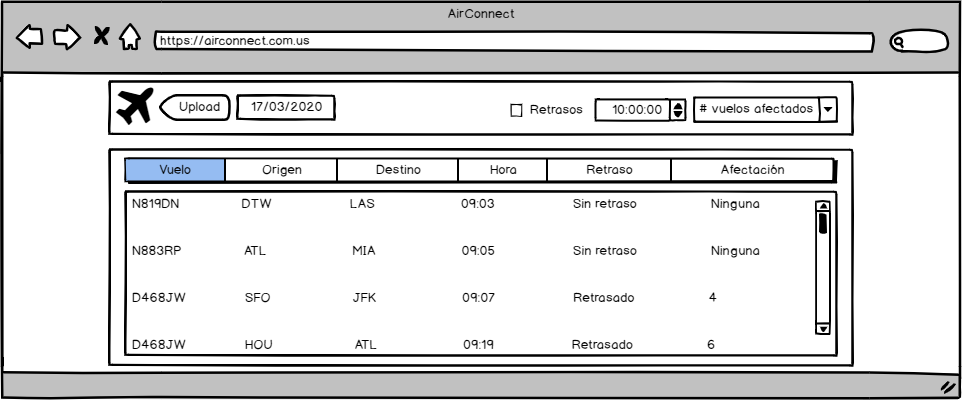
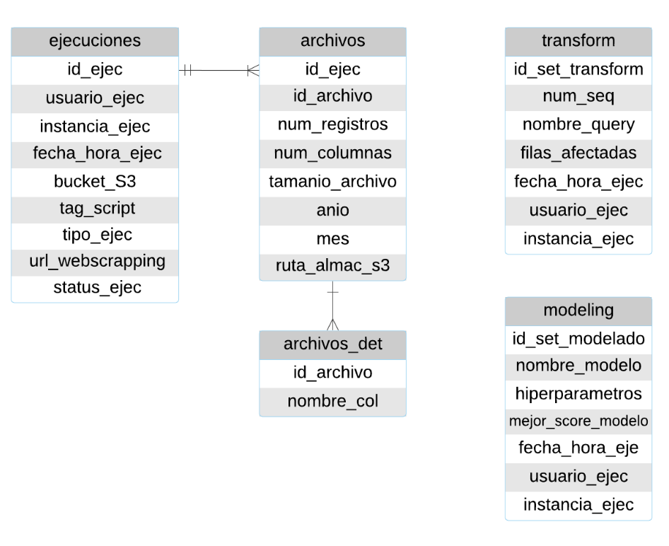

# Retraso y afectación de vuelos operados por Southwest Airlines Co.

El presente proyecto analiza los vuelos de la aerolínea estadounidense *Southwest Airlines Co.* con el fin de detectar retrasos de vuelos de más de 20 minutos en su despegue ocasinando un efecto dominó de 2 o más vuelos consecutivos. Los vuelos operados por la aerolínea *Soutwesth Airlines Co.* representan el 20.6% del total de vuelos nacionales en Estados Unidos, en el periodo comprendido de enero 2016 a diciembre 2019. Durante este periodo, el 25% de los vuelos de la aerolínea sufrieron un retraso en su despegue mayor a 20 minutos. Alertar a la aerolínea anticipadamente sobre posibles retrasos le permitiría conocer anticipadamente pérdidas monetarias asociadas a dichos retrasos, activar de planes de contingencia; y tomar acciones encaminadas a la disminución de costos operativos, contribuyendo en la mejora de la eficiencia de sus operaciones.


## Contenidos

1. Introducción
2. Resumen General
3. Requerimientos e Infraestructura
4. Instalación y configuración
5. Corrida del Pipeline
6. Organización del código
7. Colaboradores


## 1. Introducción

**Maestría en Ciencia de Datos ITAM**

La maestría en Ciencia de Datos del Instituto Tecnológico Autónomo de México (ITAM) es un programa que busca desarrollar en los estudiantes habilidades computacionales en el diseño y uso de bases de datos en varias escalas de magnitud, dominio de técnicas estadísticas modernas aplicadas al análisis y uso productivo de datos, así como habilidades en el uso de lenguajes de programación y sus aplicaciones para desarrollar software. Como parte del programa de maestría, en segundo semestre se imparte la materia de *Arquitectura y Producto de Datos* la cual busca desarrollar un producto de datos de inicio a fin. Este proyecto corresponde al producto desarrollado a lo largo del semestre primavera 2020.

## 2. Resumen General

**Descripción de la base de datos**

La base de datos con la que se trabajará contiene detalles sobre el despegue y arribo de los vuelos comerciales dentro de Estados Unidos de octubre de 1987 a enero de 2020. El dataset contiene alrededor de 100 variables y se encuentra ubicado en [RITA](https://www.transtats.bts.gov/DL_SelectFields.asp?Table_ID=236). La información está disponible en archivos con formato .csv; y en principio es actualizada de forma mensual; sin embargo se desconoce la fecha exacta de actualización.

Considerando la cantidad de variables disponibles y tomando como base la información que fue utilizada en el concurso [data expo Airline on-time performance](http://stat-computing.org/dataexpo/2009/the-data.html), nos limitaremos a trabajar con 15 variables. El detalle y descripción de las variables finales puede encontrase en esta liga [variables](https://github.com/Millan13/dpa_equipo2/blob/dpa-laura/docs/descripcion_variables.md).


**Mockup**

Con respecto al producto final de datos, se pretende desarrollar una API que permita filtrar por fecha y enliste los vuelos junto con el Origen, Destino, Hora de Salida y una etiqueta más indicando si el despegue del éste se retrasará más de 20 minutos creando un efecto dominó en al menos 2 vuelos consecutivos, o no.



**Implicaciones éticas**

Sin excepción alguna, cualquier producto de datos trae consigo una serie de implicaciones que deben considerarse en el alcance del modelo.

Particularmente dividimos las implicaciones éticas en falsos positivos y falsos negativos:

+ Falsos positivos
  + Propiciar movilización y sentido de alerta del personal involucrado a raíz de la alerta de retraso, cuando en realidad tal retraso no existirá.
  + Aumento de costos de operación de la aerolínea relacionados con el aumento de horas de trabajo del personal, solicitar equipos de tránsito/seguridad, etc.


+ Falsos negativos
  + Aglomeración de pasajeros en ciertos horarios por tener vuelos retrasados.
  + Falta de espacios disponibles para pasajeros que esperan la salida.

**Pipeline**

El pipeline diseñado para analizar el retraso de los vuelos implica descarga y almacenamiento de los datos, limpieza, transformación y *feature engineering*, modelado, evaluacón, puesta en producción y monitoreo.


**Proceso ELT**

La primera parte del pipeline anterior requiere de un proceso ELT que permita tener los datos en un formato adecuado para poder correr la parte de modelado. De manera breve, el proceso ELT consta de lo siguiente:

>**Extract.** Esta parte del proceso consta de dos etapas. En un primer momento es necesario hacer la carga inicial que permita obtener los datos históricos con los que se desarrollará el producto de datos. Por otro lado, es necesario realizar una carga periódica (mensual) con los datos sobre los cuáles se realizarán las predicciones.

>**Load.** Bajo esta sección del código se establecerá una conexión entre la instancia EC2 y el servicio de almacenamiento S3, en donde permanecerán tanto los datos históricos, como los que se descarguen mensualmente. Adicional, los datos históricos serán enviados al esquema *Raw* ubicado en el servicio RDS, para su posterior transformación.

>**Transform.**


**Linaje**

Puesto que los datos sufren transformaciones a lo largo de todo el pipeline, es importante tener la trazabilidad de todas estas modificaciones. La metadata que se generará durante el pipeline será almacenada en una base de datos conforme a lo siguiente:



El detalle de cada uno de los campos de la metadata se ubica en [diccionario linaje](https://github.com/Millan13/dpa_equipo2/blob/dpa-laura/docs/diccionario_linaje.md).


## 3. Requerimientos e Infraestructura

Los datos que se utilizan son almacenados en un bucket S3 de AWS, una instancia EC2 de AWS es utilizada para correr todo el código; y los resultados de cada etapa son almacenados en un servicio RDS de AWS.

```
Infraestructura: AWS

+ AMI: ami-0915e09cc7ceee3ab, Amazon Linux AMI 2018.03.0 (HVM)
+ EC2 instance:
  + GPU: 1
  + vCPU: 1
  + RAM: 1 GB
+ OS: Linux AMI 2018.03.0
+ Volumes: 1
  + Type: gp2
  + Size: 16 GB
+ RDS: PostgreSQL
  + Engine: PostgreSQL
  + Engine version: 10.6
  + Instance: db.t2.micro
  + vCPU: 1
  + RAM: 1 GB
  + Storage: 80 GB


```

## 4. Instalación y configuración

**4.1 Requerimientos**

En complemento a la infraestructura descrita en le punto 3, será necesario el siguiente software:

+ git

A partir de ahora, todas las instrucciones deben ejecutarse en la terminal de la instancia ec2.

```
sudo yum install git-all
```
**4.2 Clonar el repositorio**

Después de instalar git, es necesario clonar este repositorio. Posteriormente, desde la carpeta Scripts ubicada en dpa_equipo2 se debe correr el script 00_install_packages.sh

```
cd dpa_equipo2/Scripts
sh 00_install_packages.sh
```

## 5. Corrida de Pipeline

## 6. Organización del código

## 7. Colaboradores

+ Laura Gómez Bustamante
+ Miguel Ángel Millán Dorado
+ Elizabeth Rodríguez Sánchez
+ Marco Julio Monroy Ayala
+ Rodrigo Suárez Segovia
